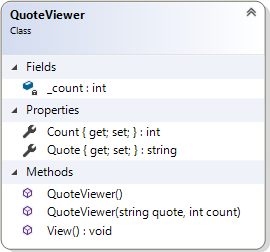

# Repeterbara citat

- [GitBook](https://coursepress.gitbook.io/1dv024/ovningsuppgifter/del-2/repeterbara-citat)
- [Lösningsförslag](https://github.com/1dv024/exercise-solution-proposals/tree/master/exercise-repeatable-quotes)

## Uppgift

I projektet som hör till övningsuppgiften skapas två objekt av klassen `QuoteViewer` i metoden `Main`. Problemet är att klassen `QuoteViewer` saknas. Din uppgift är att skriva en klassdeklaration så att koden i `Main`-metoden kan köras utan att förändras och utan problem. Programmet ska ge utskriften enligt nedan.

```
-----
I have a dream.
I have a dream.
I have a dream.
I have a dream.
I have a dream.
I have a dream.
I have a dream.
-----
-----
Make love, not war.
Make love, not war.
Make love, not war.
-----
-----
Et tu, Brute
Et tu, Brute
Et tu, Brute
-----
```

Du får inte redigera koden i klassen `Program` på något sätt. All kod du skriver ska skrivas i klassdeklarationen till klassen `QuoteViewer`. Genom att analysera utskriften, klassdiagrammet och metoden `Main` ska du komma fram till hur klassen ska implementeras.



Figur 1. Klassen QuoteViewer.

### Program.cs

```cs
namespace RepeatableQuotes
{
    /// <summary>
    /// Represents the main place where the program starts the execution.
    /// </summary>
    class Program
    {
        /// <summary>
        /// The starting point of the application.
        /// </summary>
        static void Main()
        {
            // Create a new QuoteViewer object using the default
            // constructor, assign the object values using properties and
            // call a method.
            QuoteViewer qw = new QuoteViewer();
            qw.Quote = "I have a dream.";
            qw.Count = 7;
            qw.View();
​
            // Create and initiate another QuoteViewer object using
            // constructor having two parameters and calls a method.
            QuoteViewer anotherQw =
                new QuoteViewer("Make love, not war.", 3);
            anotherQw.View();
​
            // Change the object data using a property and call a method.
            anotherQw.Quote = "Et tu, Brute";
            anotherQw.View();
        }
    }
}
```

## Mål

Efter att ha gjort uppgiften ska du kunna:

- Implementera en klass genom att tolka ett klassdiagram och programkod som använder objekt som instansierats av klassen.

- Förstå vad ett fält (field) är och hur du deklarerar ett sådant.

- Skriva en standardkonstruktor och förstå vad konstruktorer har för roll.

- Förstå att en klass kan ha flera konstruktorer så länge de har olika parameterlistor. Kallas överlagring (overloading).

- Skriva egenskaper (properties).

- Kunna skriva en metod som inte returnerar något värde (void) och som inte har någon parameterlista.

## Tips

Läs om:

- Klasser och fält
  - Essential C# 6.0, 217-228.
  - ​https://msdn.microsoft.com/en-us/library/0b0thckt.aspx​
- Konstruktorer
  - Essential C# 6.0, 254-263.
  - ​https://msdn.microsoft.com/en-us/library/ace5hbzh.aspx​
- Metoder
  - Essential C# 6.0, 161-177.
  - ​https://msdn.microsoft.com/en-us/library/ms173114.aspx​
- Egenskaper (properties)
  - Essential C# 6.0, 237-244.
  - ​https://msdn.microsoft.com/en-us/library/x9fsa0sw.aspx 